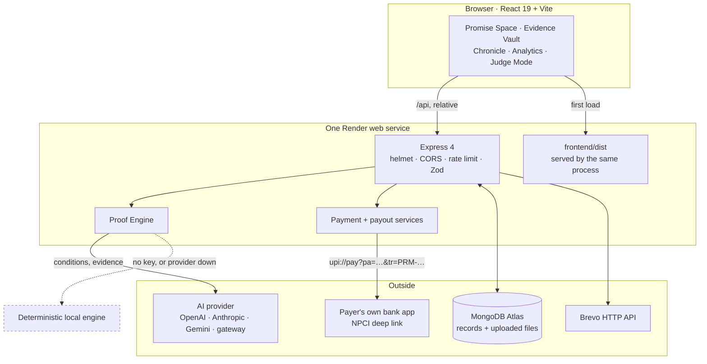
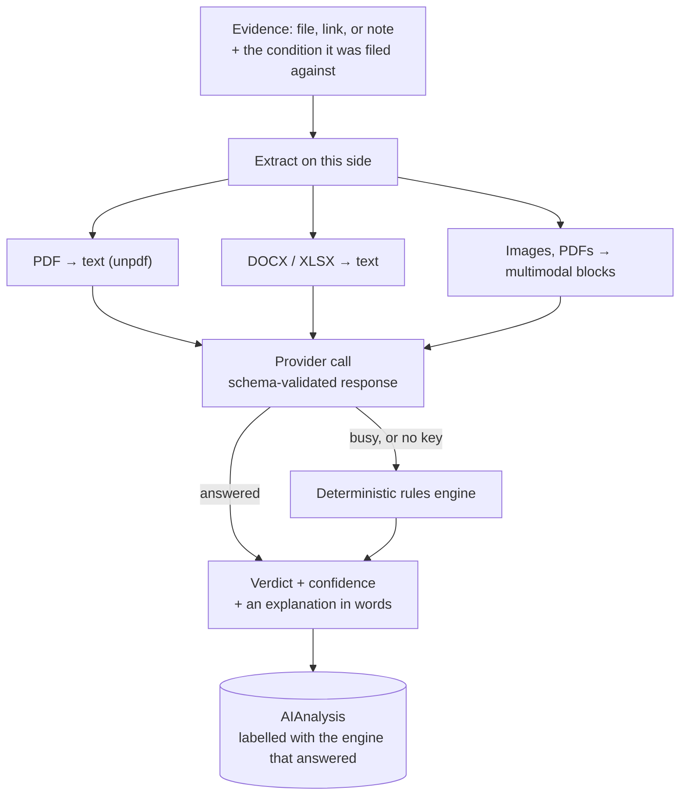
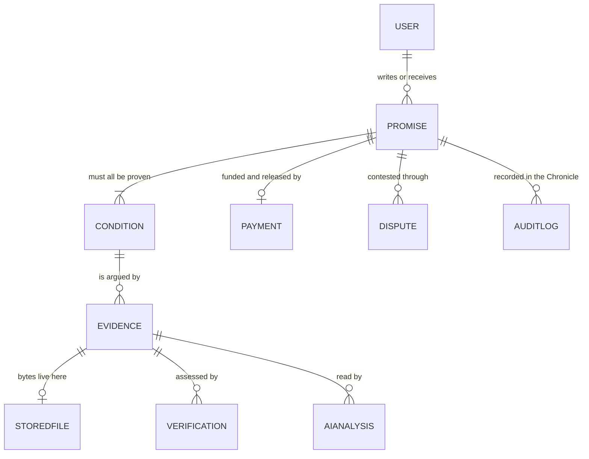

# Architecture

One Node service serves the API and the built interface from a single origin.
The browser calls `/api` as a relative path and the session is a `sameSite: 'lax'`
cookie — split the two across origins and the cookie stops being sent, so every
request arrives signed out.

---

## The shape of it



**Money never enters this diagram's middle column.** The service issues an NPCI
deep link and records what the payer reports back. It has no custody, which is
what lets it exist without a payment aggregator licence.

---

## The one-way path from a sentence to a payment

Each arrow is a state change something else is allowed to observe, and the two
gates are the load-bearing parts.

```mermaid
flowchart LR
    A["Promise written<br/>in plain English"] --> B["Conditions<br/>parsed"]
    B --> C["Funded<br/>held conditionally"]
    C --> D["Evidence filed<br/>against one condition"]
    D --> E["Proof Engine<br/>reads the artefact"]
    E -->|"≥ 70% confidence"| F["Condition verified"]
    E -->|"below, or contradicts"| D
    F --> G{"Every condition<br/>proven?"}
    G -->|no| D
    G -->|yes| H["READY_TO_FULFILL"]
    H --> I{{"Payer signs in and<br/>types a confirmation"}}
    I --> J["RELEASED<br/>the payer's decision"]
    J --> K["Payout rail<br/>queued → processed"]
    K --> L["UTR recorded as<br/>reported by the payer"]

    style I stroke-width:3px
    style J stroke-width:3px
```



Two things this diagram is drawn to make unavoidable:

**There is no path from a model to a payment.** The engine's output can move a
condition to verified. It cannot reach `RELEASED` — that edge requires an
authenticated payer and an explicit typed confirmation.

**Released is not arrived.** `PAYMENT_STATUS` stops at `RELEASED`, which records
a decision. A separate `PAYOUT_STATUS` (`queued → pending → processing →
processed`, plus `reversed`, `rejected`, `failed`) records what the rail did.
ProofPay cannot ask a bank whether a transfer settled, so no payout is ever
marked provider-confirmed on a UPI rail — the reference is graded on what its
structure can support and stored as *reported by the payer*.

---

## The Proof Engine



Text is extracted **before** dispatch rather than left to the provider. Every
vendor claims to read PDFs and each does it differently; an OpenAI-compatible
gateway may accept a file part, ignore it in silence, or reject it. The silent
case is the dangerous one — the model then reads a *filename*, correctly caps its
confidence because contents were not provided, and the interface shows a reading
of a document nobody opened. That is incident 1, and it returned the day a
gateway became the active path.

The deterministic engine is a real fallback, not a stub, and the interface always
labels which engine answered. On the hand-labelled evaluation set it scores
higher than the model — see [`backend/eval/report.md`](backend/eval/report.md).
Both make **zero false accepts**, which is the number the report ranks on:
waving through a claim with nothing behind it is the error that moves money
wrongly.

---

## Data model



`StoredFile` is the newest of these and exists because of incident 7: uploads
used to be written to the container's filesystem, which the host wipes on every
redeploy, while the Evidence rows survived in MongoDB. The vault went on
rendering proof — its size, its type, the engine's verdict — for files that had
not existed for hours, with no error anywhere. **A record and the thing it
describes must not have different lifetimes**, so the bytes now live beside the
record.

`AuditLog` is append-only and is what the Chronicle reads. Nothing in the
codebase updates or deletes an entry.

---

## Repository layout

| Path | What lives there |
|---|---|
| `backend/src/routes` | HTTP surface, one file per resource |
| `backend/src/controllers` | Request handling; no business rules |
| `backend/src/services` | The rules: `proofEngine`, `scoring`, `paymentService`, `payoutService`, `aiClient` |
| `backend/src/models` | Mongoose schemas and `constants.js`, the shared vocabulary |
| `backend/src/middleware` | Auth, validation, sanitising, rate limits, uploads |
| `backend/eval` | The hand-labelled evaluation set and its report |
| `backend/tests` | 160 integration tests against a real ephemeral MongoDB |
| `frontend/src/pages` | One file per screen |
| `frontend/src/components` | Composed UI, grouped by the screen that owns them |

`constants.js` is the single source of truth for every status vocabulary shared
by the API and the interface — a status string is never spelled twice.

---

## Deliberate constraints

| Constraint | Consequence in the code |
|---|---|
| No payment aggregator licence | Non-custodial. `payoutUpi` generates an NPCI deep link; the platform is never in the path of funds. |
| A model must not be able to move money | Release requires an authenticated payer and a typed confirmation. The engine writes verdicts, never payment state. |
| Settlement cannot be verified | No UPI payout is recorded as provider-confirmed. A reference is graded on structure and stored as reported. |
| Free-tier host blocks SMTP | Mail leaves over Brevo's HTTPS API; SMTP remains for local development. |
| Free-tier filesystem is ephemeral | Uploads are stored in MongoDB, not on disk. |
| Both halves share one origin | `createApp()` serves `frontend/dist`; the session cookie stays `sameSite: 'lax'`. |

---

## Running it

```bash
npm run install:all
npm run dev          # API on :5050, interface on :5173
npm run check        # typecheck, 160 tests, production build
```

No MongoDB installed is not a blocker — the API detects an unreachable database
and boots an ephemeral one. Deployment notes are in [DEPLOY.md](DEPLOY.md); the
failures worth reading about are in [INCIDENTS.md](INCIDENTS.md).
